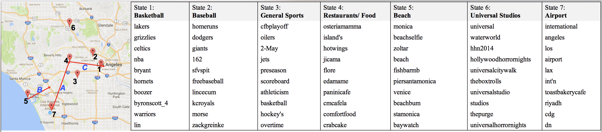

# SHMM
This repo is the SHMM model implementation of [A Spherical Hidden Markov Model for Semantics-Rich Human Mobility Modeling](https://arxiv.org/pdf/2010.01986.pdf) [AAAI2018]. 

## Table of Contents
- [Introduction](#Introduction)
- [Code](#Code)
- [Data](#Data)
- [Summarized Results](#Summarized-Results)
- [Citation](#Citation)


## Introduction
SHMM, a multi-modal Spherical Hidden Markov Model is designed for semantics-rich human mobility modeling. 
Under the hidden Markov assumption, SHMM models the generation process of a given trace by jointly considering the observed location, time, and text at each step of the trace.

An example model output is shown below: 

<p align="center"></p>


## Code
All code are in the folder `./code`.

### Twitter Dataset
  - To run SHMM on Twitter Dataset, run `./code/run_Twitter.sh`.

  - Hyperparameters for Twitter and Synthetic data are in `./code/run/*.yaml`.

  - **Preprocess**:

    - Twitter data preprocessing code is in `./code/Twitter/preprocess`. It is included in `./code/run_twitter.sh` as well. 

    - How to generate background data is in `./code/Twitter/Generate_background_tweet.txt`.

  - **Model Training**:

    - The main model for SHMM is in `./code/gmove`. 

  - **Post-process**:
    - To plot figures, the code is in `./code/pre-post-process`.

    - To analysis keywords for different states, the code is in `./code/Twitter/find_state_keywords.py`.

### Synthetic Dataset

  - To run SHMM on Synthetic Dataset, run `./code/run_Synthetic.sh`.

  - **Synthetic Data Generation**:
    - The code is in `./code/Synthetic-Data`. The main function is `generate_VMF_data.m`.

  - **Synthetic Data Analysis**:
    - The code is in `./code/gmove`.


## Data
Please download the dataset from [this link](https://drive.google.com/file/d/1L6TLTGXBG9DJl_we6jTn9fudHC5c4kPm/view?usp=sharing), unzip it and rename the folder `data` and put it under `./`.

Now, all raw data, processed data are in the folder `./data`.

### Twitter Dataset(LA)

- Raw tweets is in `./data/tf-la/raw/raw_tweet.txt`. 

- Background tweets (for better word embedding) is in `./data/tf-la/raw/background_tweet.txt`.

- Processed data for SHMM training is in `./data/tf-la/input/final.txt`.

- Processed data for Gmove training is in `./data/tf-la/input/sequences.txt`, `./data/tf-la/input/words.txt`.

- Results will be saved in `./Results/Twitter-LA/Results_LA.txt`


### Twitter Data(NY) 
- It has the similar data arrangement as LA. 


### Synthetic Dataset

- Synthetic dataset generation requires a template, which is in `./data/Synthetic/a_template.txt`.

- After synthetic data generation, synthetic data for SHMM training is in `./data/Synthetic/synthetic_data.txt`.

- Data parameters for generating the synthetic data is saved in `./data/Synthetic/data_para.txt` for evaluation purpose. 


## Summarized Results
Summarized Results for Twitter dataset and Synthetic dataset are in the folder `./Results`.


## Citation
```bibtex
@inproceedings{zhu2018spherical,
  title={A Spherical Hidden Markov Model for Semantics-Rich Human Mobility Modeling.},
  author={Zhu, Wanzheng and Zhang, Chao and Yao, Shuochao and Gao, Xiaobin and Han, Jiawei},
  booktitle={AAAI},
  year={2018}
}
```
